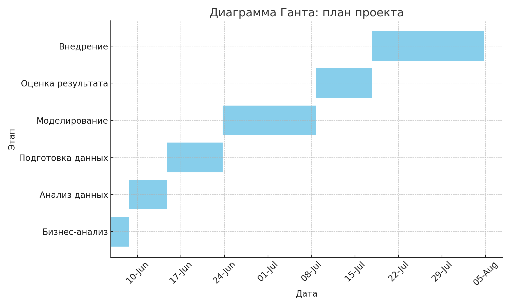

# 1. Бизнес-анализ (Business Understanding)

## 1.1 Организационная структура и общая цель

**Участники проекта (со стороны заказчика)**  
- Руководитель отдела продаж и работы со слушателями.  
- Руководитель отдела маркетинга.

**Бизнес-цель проекта**  
Цель — увеличить вовлечённость каждого клиента в фестиваль.  
Это достигается через:  
- удобный выбор концертов;
- составление целостного маршрута;
- дополнение продукта филармонии системой рекомендаций;
- формирование новых привычек участия в фестивале.

**Ключевой показатель успеха**  
- Увеличение среднего количества концертов в маршруте (выше текущего значения 4).  
- Зона внимания — маршруты с 6-9 концертами.

**Существующие решения**  
- На данный момент альтернативных сервисов маршрутов нет.  
- Пользователи вынуждены изучать афишу на официальном сайте из 100+ концертов на 10 площадках самостоятельно.  
- Имеющиеся рекламные подборки — универсальны, не учитывают личные предпочтения, быстро устаревают.

**Коммуникация и рабочие чаты**  
- Организуются цифровые каналы (например, мультичат с ветками для ключевых тем проекта).  
- Это позволит гибко обсуждать вопросы и обмениваться документами.

---

## 1.1 Текущая ситуация (Assessing current solution)

**Ресурсы**  
- Проект под силу одному квалифицированному разработчику.  
- Возможность точечного привлечения экспертов, использования брендбука фестиваля и генеративных нейросетей.

**Техническая база**  
- Аудитория фестиваля — 5-6 тыс. покупателей, до 500 одновременных пользователей на сайте.  
- Предполагаемая нагрузка не требует сложной инфраструктуры.  
- Используется VDS-хостинг, с возможностью масштабирования.  
- Постепенный запуск бета-версии и хранение данных в облаке.

**Доступ к данным**  
- Данные о концертах уже в СУБД (официальный сайт).  
- Планируется забирать их из этого же источника, декомпозировать и сохранять в собственной СУБД сервиса.  
- Динамические данные (например, количество билетов) будут напрямую подтягиваться из первоисточника.

**Консультации**  
- Заказчик готов выделять экспертов для консультаций (по аудиториям, программам и маркетингу).

**Риски проекта**  
- Не успеть реализовать нужный функционал к запуску.  
- Незначительное улучшение пользовательского опыта.  
- Дополнительные риски:  
  - Недостаточная детализация бизнес-целей.  
  - Задержки в согласованиях.  
  - Ошибки в исходных данных.

**План действий по снижению рисков**  
- Сосредоточиться на MVP с минимально необходимым функционалом.  
- Регулярно согласовывать результаты с заказчиком.  
- Проверять корректность данных и их обновление.  
- Проводить нагрузочное тестирование.  
- Подготовить план резервного масштабирования.

---

## 1.2 Решаемые задачи с точки зрения аналитики (Data Mining goals)

**Метрики качества маршрутов (приоритетные)**  
- Доля маршрутов с 6-9 концертами.  
- Silhouette Score, Calinski-Harabasz для задач кластеризации маршрутов
- R2, RMSE для задач предсказания оценки
- Время формирования маршрута.

**Метрики качества маршрутов (факультатиыне)**  
- Среднее количество концертов в маршруте.  
- Доля «докупленных» концертов после первичного выбора.  
- Разнообразие маршрутов (жанровое, территориальное).  
- Среднее расстояние (по времени и пространству) между концертами.  
- NDCG дляопределения порядка релевантных маршрутов
- Конверсия «маршрут → покупка билета».  

**Критерий успешности**  
- Увеличение среднего количества концертов в маршруте с 4 до более высокого значения.  
- Рост доли маршрутов с 6-9 концертами.  
- Положительная динамика «докупленных» концертов в дни фестиваля.

**Дополнительные метрики**  
- Частота использования сервиса.  
- Retention (возврат пользователей).  
- Средняя стоимость покупок.  
- Отзывы пользователей (NPS, тексты).
- Оценка предложенных маршрутов по специальной шкале.

**В случае отсутствия объективных метрик**  
- Оценка будет проводиться по результатам опросов пользователей и экспертным мнениям заказчика.

---

## 1.3 План проекта (Project Plan)

**Этапы проекта**  
1. Бизнес-анализ (5%, ~3 дня).  
2. Анализ данных (10%, ~6 дней).  
3. Подготовка данных (15%, ~9 дней).  
4. Моделирование (25%, ~15 дней).  
5. Оценка результата (15%, ~9 дней).  
6. Внедрение (30%, ~18 дней).

**Сроки**  
- Общий срок: 60 дней (с учётом всех этапов).  
- Заложено время на тестирование и интеграцию.

**Ключевые точки**  
- Демонстрация MVP заказчику.  
- Регулярные апдейты в мультичате.  
- Проверка на пиковых нагрузках.

